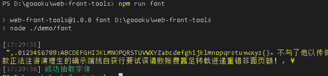
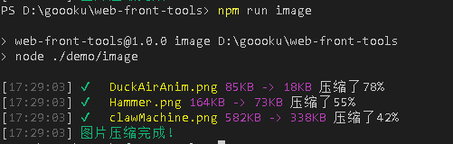

# 前端工具集

### 项目说明

> 此项目为前端的工具集合项目，使用node编写，JS语法使用的ES6。
>
> 此项目会不定期添加新的工具。

### 快速开始

* 安装`node`环境。
* 项目根目录执行`npm install`安装依赖插件。

### 目录说明

* `src`下存放的工具公用的一些函数。
* `demo`下存放的具体例子（调用`src下的基础类库`）。
* `test`目录下存放一些测试用的资源。
* `package.json`中`script`存放工具命令的启动方法。

### 具体工具

* TTF字体抽取工具
  * 简介: 完整的ttf字库太大，可将程序用的ttf字体抽取出来，只保留程序用的文字。

  * demo: 执行`npm run font` or `node ./demo/font。`

  * 注释见代码内。

  * 底层使用[fontmin](https://github.com/ecomfe/fontmin)。

  * 截图: 

    

* PNG图片压缩工具
  * demo:执行 `npm run image` or `node ./demo/image`。
  * 注释见代码内部。
  * 目前只能压缩PNG图片。
  * 底层使用 [imagemin-pngquant](https://github.com/imagemin/imagemin-pngquant)压缩的图片，可调节压缩参数，最高能压缩60%-70%左右。
  * 截图: 

### 交流

* QQ群: 223460081

